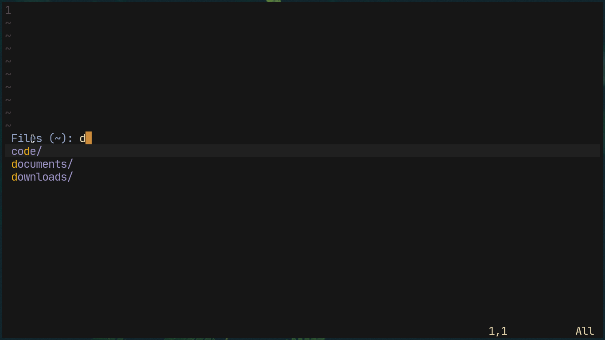
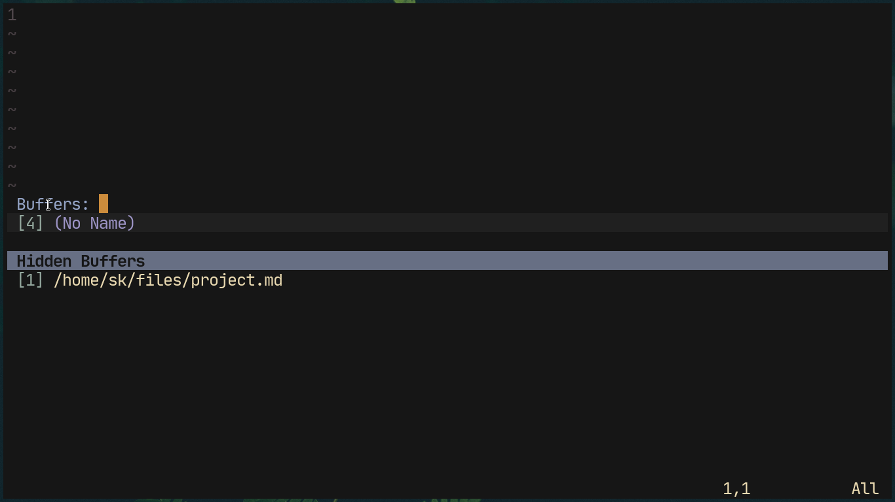

# Helm - The completion framework for love and life


`Helm` is the elder and cooler brother of [Ido](https://www.github.com/shoumodip/ido.nvim) It is yet another program originally created in Emacsland, but ported to Neovim by yours truly. It is a narrowing framework like `fzf` and the successor to ido. It's main feature is something I came up with on a whim called ***region***.

# Region


The most awesome feature in existence. Any item beginning with a `# ` is and ending with an empty item (`''`) or another `# `, is treated as a region. It is *extremely* useful, as you can jump between regions with a keypress. Here is a use case of regions --

```lua
helm_start({
  prompt = 'Choose color for keyword:',

  items = {
     '# Primary colors',
     'red',
     'yellow',
     'blue',
     '# Secondary colors',
     'orange',
     'green',
     'violet',
  },

  on_enter = function(c)
     vim.cmd('highlight! Keyword ctermfg=' .. c)
  end
})
```

This function will let you choose a color for the keywords. When executing this lua function, it will open the helm window, and you can jump between the *Primary colors* and the *Secondary colors* regions using `<A-n>` and `<A-p>` for next and previous regions respectively. (see the section Keybindings below for more information)

***NOTE***: You need to be careful about two things when it comes to regions.

## Consequetive regions

```lua
helm_start({
  items = {
    '# First region',
    '# Second region'
  }
})
```

There cannot be two consecutive regions with nothing in between. If you have to, then place a `''` between them. This is also why using the region break (`''`) is a good idea.

```lua
helm_start({
  items = {
    '# First region',
    '', -- Place the region breaker.
    '# Second region'
  }
})
```

This is perfectly alright.

## Regions are abstract
The region text is not treated as a match! A region will be shown if and only if said region contains at least one item in it. Do not type out the pattern text of a region and expect to see it. This is done as I consider regions to a an absract reasoning boundary and not an actual item.  Keep that in mind.


# Keybindings
The hotkeys used.
These are declared in `helm_mappings`. See *helm-api* for more information.

`<C-n>`    The next item
`<C-p>`    The previous item

`<Down>`   The next item
`<Up>`     The previous item

`<C-f>`    Forward a character
`<C-b>`    Backward a character

`<C-a>`    Start of line
`<C-e>`    End of line

`<Right>`  Forward a character
`<Left>`   Backward a character

`<Return>` Accept the selected item, else accept the pattern text
`<Escape>` Escape Helm, duh.

# How to use Helm.
`helm_start` is a lua function which takes a table as an argument. The table can contain four items / subtables --

`prompt` The prompt to be used. If left undefined, then `helm_default_prompt` will be used.

`items` The list of items to match on.

`mappings` Custom keybindings to be used. If left undefined, then `helm_mappings` will be used.

`on_enter` The function which will be executed on returning the value. If left undefined

For example.
```lua
helm_start({
  prompt = 'Choose',

  items = {'red', 'green', 'blue'}
)}
```

Or just use the default prompt.
```lua
helm_start({
  items = {'red', 'green', 'blue'}
)}
```

Maybe a custom function.
```lua
helm_start({
  items = {'red', 'green', 'blue'},

  on_enter = function(s) print(s .. ' is my favourite color') end
)}
```

***Note:*** Particular order does not matter here. The options can be placed in whatsoever way you want. There is no specification on whether prompt should be placed at the first or something like that.

For a more "complex" example, check out the example files imported in `menus.lua`.

# Colors
These are the highlight groups used in Helm.
***Note:*** These are adjusted to the color settings of *my* terminal configuration. To make Helm look normal in yours, you need to change some color settings.

`HelmWindow` The highlight color of the helm window.

`HelmCursor` The virtual cursor emulation used in helm.

`CursorLine` The color for the selected match.

`HelmPrompt` The color used for the prompt.

`HelmRegion` The color used for the region banners.

`HelmMatch`  The color used for the matching characters.

# API
Helm was originally from Emacsland. Therefore not provinding an API would be sacriligeous. Since helm mode is near enough infinitely extensible, therefore this is divided into 3 parts.

## Keybindings
It is divided into two parts -- the global keybindings and the temporary keybindings.

Keybindings consist of the following pattern --
`["KEYNAME"] = 'FUNCTION'`

where `KEYNAME` is the key binding in standard vim notation (`:h key-notation`).

And `FUNCTION` is a lua statement supposed to end in `()` but without the `()` at the end. For example if you have a function `bar` in file `foo`, and it is invoked by `require "foo".bar()`, you have to use `require "foo".bar` instead.

`global` These are the keybindings used in every single instance of helm.  This is set in the `helm_mappings` table. You can define your keybindings globally for every instance of Helm. Just fiddle with `helm_mappings` *after* the helm plugin has been loaded by whatever plugin manager you use.

```lua
helm_mappings = {
  ["<Right>"] = 'helm_move_cursor_begin',
  ["<Left>"]  = 'helm_move_cursor_end',
}
```

# Temporary
These are keybindings used in only one instance of helm, and are defined in the table of options supplied to `helm_start()`.

```lua
helm_start({
  items = {'red', 'green', 'blue'},

  keybinds = {`
    ["<Right>"] = 'helm_move_cursor_end'
  }
})
```

# Variables
The variables used in helm mode --

`helm_match_buffer` The buffer used for displaying the matches.

`helm_match_window` The floating window used for displaying the matches.

`helm_prompt_buffer` The buffer used for displaying the prompt.

`helm_prompt_window` The floating window used for displaying the prompt.

`helm_window_height` The height of the helm window.

`helm_prompt` The prompt of the helm window.

`helm_default_prompt` The default prompt of helm. (`Match:`)

`helm_before_cursor` The text present before the virtual cursor position in helm.

`helm_after_cursor` The text present after the virtual cursor position in helm.

`helm_selected_line` The current selected line in helm.

`helm_cursor_position` The virtual cursor position of helm.

`helm_match_list` The list of items to match against.

`helm_pattern_text` The pattern being matched in the items.

`helm_matched_items` The list of matching patterns.

# Functions
The functions defined in helm are --

`helm_exit` Close helm and reset the cursor.

`helm_accept` Accept the current item.

`helm_get_matches` Get the items which match with the pattern and highlight the matching characters.

`helm_render` Render helm.

`helm_generate_mappings` Generate keybindings for helm. No point in using this before launching helm. It will be overwritten anyway. Use this in a keybinding or whatever.

`helm_decrement_cursor` Decrement the virtual cursor position.

`helm_increment_cursor` Increment the virtual cursor position.

`helm_key_backspace` Emulate the backspace key in helm.

`helm_key_delete` Emulate the delete key in helm.

`helm_move_cursor_left` Move the virtual cursor left a character.
                  
`helm_move_cursor_right` Move the virtual cursor right a character.

`helm_move_cursor_begin` Move the virtual cursor to the beginning of the pattern.
                  
`helm_move_cursor_end` Move the virtual cursor to the endning of the pattern.

`helm_next_item` Select the next match.

`helm_prev_item` Select the previous match.

`helm_goto_next_region` Goto the next region.

`helm_goto_prev_region` Goto the previous region.

`helm_insert_char` Insert a character at the cursor.

`helm_fix_match_list` Fix the regions in the `items` table passed to `helm_start`.

# Example Functions
Helm comes with some useful functions baked in --

`helm_browse()` Browse the filesystem. Bound to `<Leader>.` in Normal mode.

`helm_buffers(show-hidden)` Switch between buffers. If `show-hidden` is `true`, then the hidden buffers will be shown, else not. `<Leader>,` and `<Leader>bb` are used for opening it without showing the hidden buffers (i.e, `show-hidden` is `false`) in Normal mode. `<Leader>>` and `<Leader>bB` are used for opening it with `show-hidden` set to `true` (i.e, show hidden buffers) in Normal mode.

`helm_describe_function()` Describe a function in Neovim. ***Note:*** Some functions will not have a help file, as this uses the `getcompletion` function of Vim to get the function names, which does'nt care whether they have a help file or not. However most of them (`99%`) will have one. Bound to `<Leader>hf` in Normal mode.

`helm_describe_variable()` Describe variables and options in Neovim. ***Note:*** Just like `helm_describe_function()`, some variables will not have a help file, as these are *user-defined* variables, therefore the chance of them having a help file depends on how thoughtful *you* are (jk). Bound to `<Leader>hv` in Normal mode.

`helm_filetype()` Set the filetype of a particular buffer. This is, **imho**, the greatest function since sliced bread. Bound to `<Leader>ft` in Normal mode.

`helm_command()` Search through the functions available in Neovim. Upon selecting one, it will activate command-mode (`:`) with the command you selected already residing there. Bound to `<Leader>;` in Normal mode.
